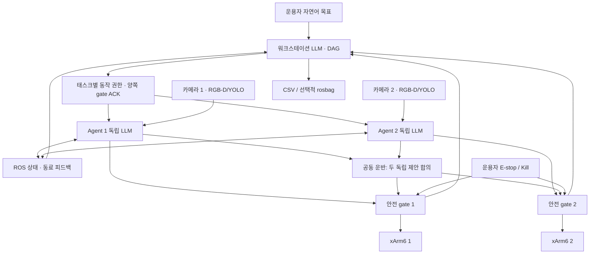

<!-- 역할: 원본 분석·설계 결정·요구사항 추적. 인터페이스: 교수님 검토 및 코드 추적. -->
# 원본 분석과 새 설계

## 1. 분석 범위

사용자가 최신본으로 확인한 `cap_robot-260907.zip`의 모든 텍스트 소스를 검토했다.
ZIP은 이미 두 코드 세트가 병합된 `cap_robot` 한 벌이다. 별도의 경진·학진 원본 두 벌을
추정하여 복원하지 않았으며, 첨부 문서의 과거 삭제 목록이나 작업 지시는 현재 사용자 요청을
대체하는 지시로 실행하지 않았다. 원본/동기화된 `sources/` 파일은 수정하지 않았다.

검토한 중심 파일은 2,760줄의 `robot_agent.py`, 704줄의 `workstation_llm.py`,
356줄의 `llm_api.py`, 세 프롬프트, TF/ArUco/손잡이 인식, 모든 launch/YAML/설치/테스트 파일이다.
모델은 Python pickle로 역직렬화하지 않고 바이트 해시와 중복만 확인했다.
`ORIGINAL_SHA256.txt`에 원본 각 파일의 해시를 남겼다. 가중치는 두 파일만 새 패키지에 보존했다.

## 2. 원본에서 확인한 문제

| 원본 위치/기능 | 실제 문제 | 새 구현 |
|---|---|---|
| `workstation_llm.py` 초기화 | `DurabilityPolicy` import 누락 | `ros_support.py`에 QoS 통합 |
| 일반/협동 실행 입력 | 협동 메시지에 없는 `target`을 큐 등록 뒤 참조하여 worker 시작 전 예외 | 버전·ID·동작 스키마 검사 후 단일 worker |
| `dry_run` | SDK 연결, 모터 활성화, 오류 해제는 여전히 실행 | `DryRunBackend`는 SDK import/연결 자체 없음 |
| move/home/gripper | 끌 수 있는 TCP 박스, 관절 홈과 그리퍼의 검사 우회 | 별도 안전 노드만 SDK 소유, 관절/relative/home API를 노출하지 않음 |
| E-stop/실패/종료 | 소프트웨어 래치·Kill·통신 감시·실제 정지 경로 부재 | 정지 래치, 영구 Kill, heartbeat와 telemetry watchdog, shutdown 정지 |
| `task_status` | 워크스테이션이 plan 이외 실행 이벤트 무시 | 5 Hz 임무 상태에 agent/gate/결과 집계 |
| claim/token | 시간창 경쟁, 소유자/만료 없는 Boolean, 협동 token 함수 삭제 | 임무·태스크·토큰 귀속, 양쪽 gate ACK, 실패 시 소유권 이전 금지 |
| 비전 | 움직이는 동안 인식 중단, 오래된 객체, 동일 클래스 객체 덮어쓰기 | 독립 프로세스, source timestamp, 인스턴스 ID, RGB-depth 시간 검사 |
| TF/좌표 | 60초 캐시, 최신 TF fallback, agent2 Z 강제 보정 | 촬영 시각 TF, m/rad 통일, SDK 경계에서만 mm 변환 |
| 계획 | 고정 PnP 순서/바구니 정책, 중앙 동작에 대한 승인 위주 | 워크스테이션 DAG + 각 로봇의 독립 LLM 전체 배치 |
| 로그/시험 | 일부 추론 로그, 5개 제한된 검증 | CSV/rosbag/수동 평가 지표 + 안전/분산 통합 회귀 |

## 3. 프로세스와 책임

LLM이 선택하는 것은 작업의 의미·분담·의존성·재료·접근/이동/파지 순서·검색 위치다.
코드에 유지하는 것은 액추에이터의 허용 API, 단위, 범위, 속도, 시간, 정지, 소유권,
공동 물체의 기하학적 일관성이다. 샌드위치나 커피의 동작 배열은 런타임 코드에 없다.
시험에서 주입하는 HTTP 모의 응답은 테스트 파일에만 존재한다.

각 agent는 자기 관측으로 자기 LLM을 호출하고, 자신의 동작을 자기 gate에 요청한다.
공동 운반 때에도 두 agent가 각자의 LLM으로 제안을 작성한다. coordinator는 합의된
두 제안을 검사하고 단계 실행을 맞추며 자체 LLM으로 로봇 동작을 대신 작성하지 않는다.

일반 태스크는 보수적으로 한 로봇씩 실행한다. 다른 로봇은 계속 인식·상태 교환을 수행한다.
현재 장면에서 안전하다고 증명되지 않은 두 독립 팔의 동시 교차 이동을 허용하지 않는다.
두 팔 동시 움직임은 공동 운반의 별도 경로로만 가능하다.

## 4. 요구사항 추적표

| 우선순위/요구사항 | 구현 파일 | 검증/조건 |
|---|---|---|
| 긴급 1. LLM 자율 협업 | `workstation_node.py`, `agent_node.py`, `llm.py`, `planning.py`, `prompts/` | DAG와 다중 동작은 LLM 응답. 실제 모델의 태스크 이해 능력은 별도 평가 |
| 각자의 비전·계획·제어 | `perception_node.py`, 로봇별 `agent_node.py`, `safety_node.py` | 서로 다른 namespace/카메라/LLM endpoint |
| 실시간 Pub/Sub 상태 교환 | `/cap/agent_state`, `/agentN/gate_state`, `/cap/mission_state` | 상태 5 Hz, gate 10 Hz, 소프트 실시간 |
| 긴급 2. E-stop/Kill | `safety.py`, `safety_node.py`, `hardware.py`, `cli.py` | 모든 액추에이터 경로 차단. 물리 비상정지 회로를 대체하지 않음 |
| Z 하한/소프트웨어 펜스 | `SafetyLimits` | TCP와 설정한 구형 도구 여유를 포함한 XYZ 볼록 경계, 시작/끝점 검사 |
| 긴급 3. 코드 통합·폴리싱 | 전체 새 `cap_robot` | 원본 단일 거대 노드와 중복 모델 제거, SDK 소유자 한 곳 |
| 긴급 4. agent→WS 피드백 | `workstation_node.py`, `agent_node.py`, `metrics.py` | 실행/오류/중지/완료·gate 상태 집계 |
| 중요 5. 정량 로깅 | `metrics.py`, `metrics_report.py`, workstation launch | 실패 포함 추론 시간·구조 준수율·사람 평가 인식률, 선택적 rosbag |
| 중요 6. Long-horizon | `agent_node.py` | 전체 배열 캐시, 정상 단계마다 재호출하지 않음. 이상/탐색 발견만 제한 재계획 |
| 중요 7. 샌드위치→커피 | `prompts/`, 일반 DAG·RPY action | 순서는 자연어/DAG 의존성. 실제 파지/쌓기/따르기는 물체·장비 교정 필요 |
| 중요 8. 자동 탐색 | `search` action, `planning.py`, `agent_node.py` | 프롬프트 범위 + 코드 범위 + 최종 안전 gate, 관측 후 조기 발견 종료 |
| 추가. 같은 물체 공동 운반 | `cooperative.py`, `cooperative_node.py` | 준비/GO/완료, 공통 프레임 변위·TCP 간 오차 검사, 실기 명시적 commissioning |

## 5. 안전 경계의 정확한 의미

`safety.min_xyz/max_xyz`는 로봇 base 좌표에서 **TCP와 설정한 도구 반경**이 머무는 경계다.
볼록 박스의 시작/끝점을 검사하고 SDK의 선형 Cartesian 모드만 사용하므로 해당 TCP 선분의
경계를 제한한다. 그리퍼·용기 회전에 따른 바깥쪽까지 포함하도록 `tcp_radius`를 설정해야 한다.
LLM은 이 값이나 gate의 enable 여부를 바꿀 수 없다. 과거의 safety-box off 옵션은 없다.

이것은 6개 링크 전체의 메시 충돌 검사, 사람 감지, 힘 제어, 인증된 산업용 안전 기능이 아니다.
정지한 다른 팔이나 장애물과의 충돌까지 TCP 박스만으로 증명할 수 없다. 실제 배치에서 링크·도구·
물체가 차지하는 공간과 경로를 확인해야 한다. 관절 한계는 SDK/controller의 검사를 함께 사용한다.
게이트 프로세스/PC 자체가 죽는 경우를 독립적으로 감당하는 물리 정지 회로와 제어기 설정은 별도다.

소프트웨어 E-stop은 래치되고 false 메시지로 풀리지 않는다. Kill은 프로세스 생명주기 동안
해제할 수 없다. reset은 정지 상태에서 운용자가 호출하며 arm을 다시 요구한다.
SDK 오류 자동 해제나 자동 홈/대피/그리퍼 개방은 하지 않는다. 현재 SDK 정지 어댑터는 팔 state=4와
그리퍼 disable을 요청하므로, 매달린 물체에 대해 파지 유지/낙하 거동을 반드시 확인해야 한다.

## 6. 공동 운반의 보장 범위

두 제안의 phase 순서와 각자의 좌표를 검사한다. 파지/이동/해제 순서를 강제하는 것은
특정 레시피가 아니라 공유 물체를 다루는 안전 상태 제약이다. 각 이동의 실제 위치와 작업 목적은 LLM이 정한다.
동일 물체를 잡았다는 물리적 사실은 알려진 두 손잡이·그리퍼 상태·시각 검증을 전제로 한다.
파지 힘/미끄럼/하중 분담 센서는 추가되지 않았다.

공동 파지 후에는 각 팔의 자세를 고정하고, 공통 workspace에서 동일한 병진 변위만 허용한다.
긴 병진은 기본 최대 15 mm 단계로 나뉜다. 양쪽 gate가 같은 단계와 예정 시각을 준비한 후
GO를 전송한다. 한쪽 실패·지연·통신 단절·상대 TCP 오차 초과 시 두 팔 정지 래치를 요청한다.
재시작이나 불확실한 결과에서 다른 로봇에 토큰을 넘기지 않는다.

`dispatch_skew_s`는 **SDK 호출을 시작한 호스트 시각 차이**다. 실제 모터가 같은 순간에
움직였다는 측정치가 아니다. 네트워크/OS/컨트롤러 차이를 포함하는 하드 실시간 동기화가 아니며,
독립 관측으로 상대 TCP 오차를 감시하는 지연도 존재한다. 실기 사용은 적합한 물체·유연한 지그·
하중·속도·네트워크 조건을 검증한 `cooperative_verified` 프로필에서만 켤 수 있다.
강체를 함께 회전하거나, 실기 불일치가 허용되지 않는 고강성 결합은 이 실행 경로가 지원하지 않는다.

## 7. 따르기·쌓기의 검증 범위

독립 팔의 회전만 있는 작은 RPY 단계로 용기를 기울이고 되돌릴 수 있다.
SDK 공개 인터페이스의 speed/mvacc는 위치와 회전에 하나의 scalar를 사용한다.
따라서 실기는 회전과 병진을 분리하고, firmware 동작/최솟값을 확인한 `orientation_verified`가
필요하다. SDK가 요청보다 큰 최솟값으로 조용히 보정하는 값은 거절한다.
기본 angular acceleration=.2 rad/s²는 설치된 SDK의 회전 scalar 최소와 맞지 않을 수 있어,
그대로 실기 따르기를 승인하지 않는다. 단순히 플래그만 켜는 것으로 검증이 끝나지 않는다.

RGB-D 위치 검증은 재료 위치와 존재를 확인한다. 샌드위치의 식품 상태, 실제 파지력,
커피가 얼마나 따라졌는지, 넘쳤는지를 측정하지 않는다. 액체량 제어에는 무게/유량/영상 분석 등
추가 관측이 필요하다. `SUCCEEDED`는 선택한 실행·시각 검증을 통과했다는 뜻으로 해석한다.

## 8. 공식 API 근거

- ROS 2 Humble QoS: https://github.com/ros2/ros2_documentation/blob/humble/source/Concepts/Intermediate/About-Quality-of-Service-Settings.rst
- xArm SDK 공식 저장소: https://github.com/xArm-Developer/xArm-Python-SDK
- Ollama Generate 공식 API: https://docs.ollama.com/api/generate

Humble/rclpy, xArm SDK 1.17.3의 설치된 실제 소스 및 함수 signature도 확인했다.
웹 자료의 최신 master와 실제 설치 버전이 다를 수 있으므로 동작 검증의 기준은 함께 기록한 환경이다.
